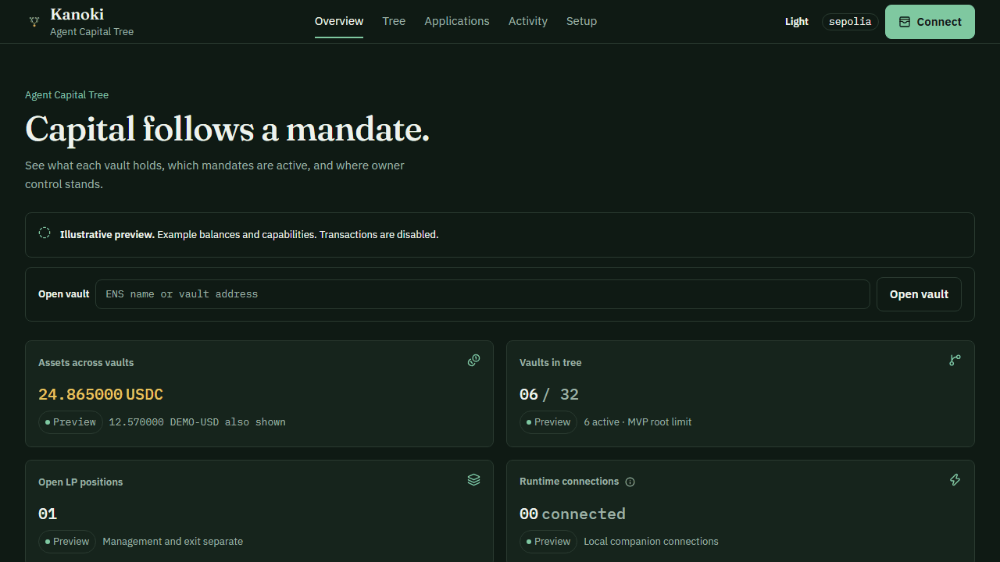

# Agent Capital Tree

**Give AI agents capital without giving them the whole wallet.** A human funds a root vault, then agents delegate smaller amounts into separate child vaults. ENSv2 roles and contract-enforced ancestor policies narrow what each child can do. The owner retains an independent recovery path.

**ENSv2 Enhanced Access Control** supplies the roles. Separate vaults bound each agent’s available funds. **Uniswap v4** enables bounded swaps and liquidity positions; **x402** enables service purchases with official Circle **USDC**. **Curvegrid MultiBaas** indexes the controller’s capital and strategy events.



*Illustrative flow. The dashboard and MCP read current Ethereum Sepolia state independently.*

[Live dashboard](https://agent-capital-tree.vercel.app) · [Live Sepolia tree](https://agent-capital-tree.vercel.app/tree?vault=capital.agentcapitalvault.eth) · [MCP guide](https://agent-capital-tree.vercel.app/mcp) · [Local setup](docs/local-setup.md) · [Jury walkthrough](docs/jury-demo.md) · [Current status](STATUS.md)

The prototype runs on **Ethereum Sepolia (chain 11155111)** with official Circle **Test-USDC**. **Uniswap v4** supports bounded swaps and vault-owned liquidity positions. **x402** supports scoped service purchases. **Curvegrid MultiBaas** indexes controller capital and strategy events. Public contract addresses are in [usdc-sepolia.json](deployments/usdc-sepolia.json). This is an unaudited hackathon prototype using testnet assets.

## Try the live tree and local MCP

Open the [live root vault](https://agent-capital-tree.vercel.app/tree?vault=capital.agentcapitalvault.eth) to inspect a real Sepolia tree without a wallet. Explicit preview mode contains illustrative balances and names. The dashboard shows wallet controls, but viewing a vault does not start a worker or authorize a transaction.

To check the keyless local MCP from the current checkout, use Node 22+, pnpm and Codex CLI. From an existing checkout, start at `pnpm install`; clone only when you need a new checkout:

```sh
git clone https://github.com/CodeByNikolas/agent-capital-tree.git
cd agent-capital-tree
pnpm install --frozen-lockfile --ignore-scripts
pnpm --filter @agent-capital-tree/sdk build
pnpm --filter @agent-capital-tree/plugin build
pnpm mcp:doctor
pnpm mcp:verify
pnpm mcp:chat-verify

```

These checks need internet access for the public app and Sepolia RPC. They use a disposable Codex profile or a keyless local STDIO server and send no transaction. The [setup guide](docs/local-setup.md) explains how to register that server in Codex or Claude and ask for the live tree image. Wallet and companion writes have separate prerequisites and acceptance status in [STATUS.md](STATUS.md).

## How it works

1. A human creates and funds a root vault, then authorizes a master-agent operator.
2. The master transfers part of its capital into a child vault. Children may delegate again within a three-level tree.
3. Each node has a real ENS subname and EAC roles. Our controller explicitly checks ancestor policies, current authority, expiry and revocation.
4. Each runtime worker has its own key, workspace and authenticated MCP context in a separate Docker container. Model-supplied IDs cannot select a parent’s signer.
5. The human retains an independent recovery path for remaining assets, including closing existing LP positions.

Capital allocation is an actual transfer, not an overbookable allowance. Amount ceilings are **per action**, not cumulative spending limits. The vault’s allocated balance bounds total exposure. Model intelligence is not a security boundary; recovery does not guarantee the original dollar value.

Vaults are **non-upgradeable EIP-1167 proxies**: every root and child has a separate 45-byte contract, token balances and LP state, with one shared immutable implementation. VaultFactory deploys and initializes the controller binding in the same transaction; the implementation and initialized clones reject reinitialization. ENS registries are still deployed individually. Proxy deployment saves gas; calls incur a small delegation overhead. Existing full vaults cannot be converted in place.

The public researcher spawn used **3,556,781 gas**, down from **5,914,316** for its full-vault predecessor (**39.86% less**), including the ENS registry and capital allocation. [Both receipts](deployments/usdc-proxy-gas.json) document the comparison.

Native Codex subagents do not automatically become capital workers. For the short demo, use `createChildVault`: the current chat manages a real ENS/vault/budget without Docker or another model process. `spawnChild` is the separate autonomous-worker option. No automatic Codex hooks are enabled.

## Applications

**Service purchases:** `getPaymentServices` lists explicitly configured services. `purchaseService` follows x402 v2’s HTTP402 flow. The agent signs an exact EIP-3009 authorization for its vault, recipient, amount, validity window and nonce. The vault’s ERC-1271 verifier checks the current ENS/PAY mandate at settlement. Nonces bind the authority generation, and retries retain the same authorization. The companion independently verifies Circle’s `Transfer` and `AuthorizationUsed` receipt events.

The supported payment token is Circle Sepolia USDC at [`0x1c7D4B196Cb0C7B01d743Fbc6116a902379C7238`](https://sepolia.etherscan.io/token/0x1c7D4B196Cb0C7B01d743Fbc6116a902379C7238), with six decimals. `10000` raw units is **0.01 USDC**. Obtain test tokens from [Circle’s faucet](https://faucet.circle.com/); the app cannot mint Circle USDC.

The x402 facilitator submits the signed authorization and pays settlement gas. USDC moves from the agent vault to the service provider. The agent can sign this payment without holding ETH; direct controller transactions such as delegation and swaps still require ETH in the transaction sender's wallet. The vault itself does not need ETH.

**Uniswap:** typed swaps and vault-owned LP positions use one fixed v4 pool. Management, fee collection and exit are separate permissions. The quote token is **DEMO-USD**, a clearly valueless six-decimal demo asset. Its pool price is not a real USD valuation. Agents cannot supply arbitrary router commands or redirect outputs.

**Future work:** policy-checked generic contract transactions, cumulative/rolling spending budgets cross-currency valuation, and an owner wallet embedded directly inside chat are not implemented. A child cannot spend more tokens than its vault currently owns; "cumulative budget" here means a separate lifetime or rolling counter that would remain binding even after top-ups or trading proceeds.
The keyless MCP renders the live ENS agent tree as PNG with a Mermaid fallback.

## Dashboard

The dashboard separates overview, agent tree, root activity, agent activity, Uniswap, x402 payments, applications, MCP and setup. A shadcn/ui sidebar, readable typography, mobile layouts and system light/dark themes keep navigation focused. Selecting a node opens its capital, ENS name and inherited permissions. A zero-USDC root links to Circle's faucet; funding still uses the owner wallet.

Enter a vault contract address or a registered name under **`agentcapitalvault.eth`** in **Open vault**. Internal numeric IDs are not accepted in this field. Without a selected vault, the app shows onboarding; illustrative data requires explicit preview mode. The preview root **Main agent** at `main.preview`, its addresses, and its small **USDC** sample balances are invented UI examples, not contracts or funds. Historical ACT-A/ACT-B vaults from an earlier controller still exist on Sepolia but are not supported by this USDC dashboard. An active mandate does not imply an agent process is running.

Current balances and permissions come directly from Sepolia. MultiBaas history covers controller-emitted capital/strategy events. The Payments page independently scans Circle USDC `AuthorizationUsed` events for this tree's vaults and verifies same-transaction transfers in successful receipts. It shows the scanned block range and explicitly flags truncated coverage. This proves token settlement, but chain receipts alone cannot prove x402 merchant intent or service delivery. Indexing delay and the actual controller-history coverage boundary remain visible.

## Partner integrations

| Partner | Contribution | Code |
| --- | --- | --- |
| ENS | Nested registries, real subnames, native EAC roles including PAY; contract-enforced ancestor restrictions | [ManagedRegistry](contracts/src/ens/ManagedRegistry.sol), [Controller](contracts/src/CapitalController.sol) |
| Uniswap | Fixed-pool v4 swaps, vault-owned PositionManager NFT, typed LP lifecycle and independent owner exit | [Swap authorization](contracts/src/CapitalController.sol#L383-L409), [vault swap](contracts/src/CapitalVault.sol#L192), [LP lifecycle](contracts/src/CapitalVault.sol#L253), [FEEDBACK.md](FEEDBACK.md) |
| Curvegrid | MultiBaas event queries, receipt enrichment and canonical RPC verification for UI and MCP | [Adapter](packages/multibaas), [plan limits](docs/multibaas-plan-limits.md) |

ENS roles are actual authorization, not descriptive text metadata. MultiBaas is an indexer, not an authorization service. Its free plan allows only a 100-block backfill; indexing is configured before new demo activity.

## Curvegrid MultiBaas: usage, experience and limitations

**Use case:** make delegated agent capital movements inspectable by the human owner and queryable through MCP. MultiBaas Event Queries supply controller history filtered by root; our adapter decodes allocations, recovery, policy changes, swaps and LP events. We independently check returned events against canonical RPC receipts before displaying them.

The [Agent activity report](https://kanoki-app.vercel.app/agent-activity?vault=capital.agentcapitalvault.eth) lets reviewers select a vault, inspect its receipt-linked events, and compare allocations received, onward delegations, returns and swap input/output totals per token. These are totals from loaded events, not current balances, profit or lifetime expenditure. Source: [MultiBaas adapter](packages/multibaas/src/index.ts), [activity API](apps/web/src/app/api/activity/route.ts), [agent report](apps/web/src/components/agent-activity.tsx).

**What worked:** indexed, decoded contract events give the dashboard and MCP a common history interface. Root-filtered queries and receipt links make delegated capital flows explainable without relying on the agent's own account of what it did. Indexing was configured before the current demo's transactions.

**Limits and challenges we encountered:**

- **100-block historical backfill:** our Default/free plan permits starting event indexing at most 100 blocks behind the chain head. This is a limit on backfilling previously unindexed events, not a statement that every query can only see the latest 100 blocks. Starting the indexer late cannot reconstruct older activity on this plan. We configured indexing before new demo activity and expose its starting block. Retention is a separate limit.
- **Plan ceilings:** the instance reported 2 indexed events/second, 30,000 API calls/month and 72 hours of event-log retention. These are this plan's reported limits, not universal MultiBaas limits or a guarantee that our history is complete. Historical contract calls were also disabled; that flag is separate from event backfill. See the [recorded plan findings and sources](docs/multibaas-plan-limits.md).
- **Index status and returned events can differ:** the reported checkpoint lagged behind some events already returned by queries. The UI therefore shows the reported checkpoint, actual loaded event blocks, lag and canonical receipt verification separately. A valid receipt establishes an event's contents, not completeness of the index.
- **Pagination and availability:** summaries cover only loaded pages. More pages, missing older history or an unavailable indexer must not look like zero spending. The agent report shows loading skeletons and hides totals on history errors. Current balances, permissions and owner recovery use direct contract access independently of MultiBaas.
- **Scope:** this integration indexes our controller events. x402 USDC settlements have their own RPC-based history and are not attributed to MultiBaas. We do not claim an intentionally induced provider-outage E2E; controlled UI error responses test the display behavior only.

**Developer feedback:** clearer onboarding around backfill versus retention, explicit warnings when a requested start block exceeds the plan, and clearer checkpoint semantics relative to query results would help teams build reliable historical views. A documented example combining pagination, index coverage and reorg handling would also help.

**Setup and tests:** follow [local setup](docs/local-setup.md) and the commands below. The [MultiBaas package](packages/multibaas) contains adapter and verification tests. `node --experimental-strip-types scripts/test-agent-activity.mjs` checks exact totals and attribution; `ACT_TEST_APP_URL=https://kanoki-app.vercel.app node scripts/test-agent-activity-browser.mjs` checks the live report plus controlled loading/error states without sending transactions.

## Team

We are a two-person hackathon team building scoped capital delegation for AI agents. The team defined the product, permission model and user flows, and reviewed AI-assisted implementation; see [AI-use disclosure](docs/ai-use.md).

Public project contact: [CodeByNikolas on GitHub](https://github.com/CodeByNikolas). The second member's preferred public name/social link and individual introductions are awaiting team confirmation; this part of the submission checklist remains open.

## Run and test

For a fast local read-only check on Node 22+ hosts, run `pnpm mcp:doctor`, `pnpm mcp:verify` and `pnpm mcp:chat-verify` after installing dependencies and building the SDK and plugin. These use no wallet or signing key. The three-tool keyless server can be registered in Codex or Claude to view a live Sepolia tree and open the normal wallet browser for root setup. Its tool responses include dashboard-style PNGs with Mermaid fallback. See the [local setup guide](docs/local-setup.md).

For chat-managed vaults on Linux or WSL2, build SDK, MultiBaas, plugin and runtime, then use `pnpm mcp:capital settings <your-root-ENS-name> --enable-sepolia-writes`. The capital MCP exposes **23 tools** without Docker, a model key, private JSON or bearer copying. `selectCapitalRoot` changes the session's write target explicitly; reads never do. `getCapitalSetup` separates onchain rights from the local signer's readiness. `prepareOperatorRecovery` supports owner-reviewed recovery without importing the owner key or repeating funding. The owner authorizes the local key once; native Sepolia ETH pays its gas. `createChildVault` creates a funded vault, not a model process. The 0.10-USDC demo input limit is shared tree capital, not per child or a contract balance cap. See the [onboarding/recovery guide](docs/local-setup.md) and [actual acceptance status](STATUS.md). New changes are published on **main**.

For autonomous workers, use Node 22, pnpm 11.13.1, Docker and Foundry 1.8.3. Follow the [complete setup guide](docs/local-setup.md) for wallet/operator separation, a private companion configuration, OpenAI API-key setup (preferred) and MCP registration. The host app-server holds inference authentication; Docker workers stay network isolated and receive scoped finance tools. ChatGPT/Codex login is an alternative, and HomeBox CLIProxyAPI remains an optional explicit configuration.

```sh
pnpm install --frozen-lockfile --ignore-scripts
pnpm build
pnpm typecheck
pnpm test
bash contracts/scripts/test-contracts.sh
node scripts/test-usdc-fork.mjs --payments

```

The fork test uses the actual Circle proxy and deployed Uniswap contracts on a disposable local Sepolia fork. It checks delegation, signatures, inherited restrictions, revocation, x402 settlement, retry behavior, LP opening/closure and recovery. It does not send public transactions or override token balances. See [fork evidence](deployments/usdc-x402-fork.json) and [STATUS.md](STATUS.md) for the exact completed checks and current public acceptance.

Deployment runners require an Etherscan key in `ETHERSCAN_API_KEY` or the private file `~/.agent-capital-tree/etherscan-api-key`. They finish with explorer verification. `node scripts/verify-deployment.mjs` verifies the current implementation, factories, controller, project/child registries, quote token and all existing vault-proxy associations, without wallet access or onchain writes. Run it after additional dashboard/MCP-created roots or children. It submits standard JSON from the compiled artifact's exact settings and hash-checked sources; the key is never included in that submission's source code. Verification results are recorded in the deployment manifest.

The controlled x402 seller is loopback-only, charges 0.01 USDC, and uses the test owner as recipient. It demonstrates the real protocol; it is not an independent commercial merchant. The companion’s service allowlist is a runtime restriction, not an onchain merchant allowlist. Service content remains untrusted.

Historical browser-wallet evidence and the current native financial proof are recorded in [ACCEPTANCE.md](ACCEPTANCE.md). Native OpenAI API-key inference with `gpt-6-luna` / `high` passed funded MCP spawn, x402 payment and Uniswap swap on Sepolia ([evidence](deployments/jury-openai-native.json)). ChatGPT-login financial E2E, independent external-machine onboarding and native-marketplace financial writes remain unproven. The controlled seller and testnet token scope is stated in the evidence.

[PLAN.md](PLAN.md) records product decisions. [STATUS.md](STATUS.md) tracks completed deployment/tests and remaining work. [Submission requirements](docs/ethglobal-requirements.md) and [AI-use provenance](docs/ai-use.md) are documented for the team. The Uniswap feedback form and ETHGlobal submission still require team details and an explicit submission instruction.

Public Sepolia x402 proof: [`deployments/usdc-payment.json`](deployments/usdc-payment.json). A PAY-only researcher spent **0.01 official USDC** from its vault; retry did not charge again. [Settlement transaction](https://sepolia.etherscan.io/tx/0xfb4b340038034b5ad44a347af7d2c45951ed04adccb77935149997724a0a7f13). This was a controlled local seller, not an independent merchant or autonomous model run. Controller history is separately verified in [`deployments/usdc-multibaas.json`](deployments/usdc-multibaas.json).
